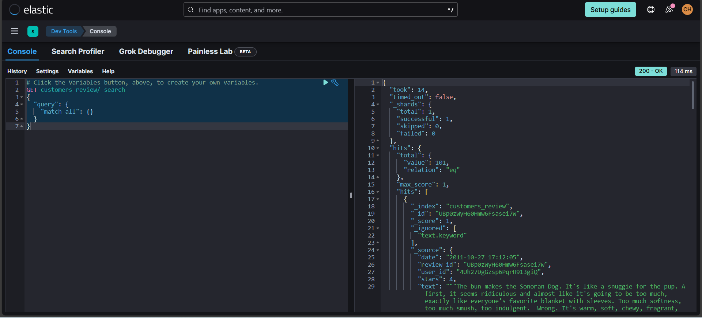

# Realtime Data Streaming With TCP Socket, Apache Spark, OpenAI LLM, Kafka, and Elasticsearch | Comprehensive Data Engineering Project

## Table of Contents
- [Introduction](#introduction)
- [System Architecture](#system-architecture)
- [What You'll Learn](#what-youll-learn)
- [Technologies](#technologies)
- [Walkthrough](#walkthrough)
- [Note](#note)

## Introduction
This project acts as a thorough guide to construct an end-to-end data engineering pipeline utilizing TCP/IP Socket, Apache Spark, OpenAI LLM, Kafka, and Elasticsearch. It encompasses each phase from data acquisition, processing, sentiment analysis with ChatGPT, production to Kafka topic, and connection to Elasticsearch.

## System Architecture


The project is structured with the following components:

- **Data Source**: The yelp.com dataset serves as our pipeline's data source.
- **TCP/IP Socket**: Utilized for streaming data over the network in chunks.
- **Apache Spark**: Employed for data processing with its master and worker nodes.
- **Confluent Kafka**: Our cluster in the cloud.
- **Control Center and Schema Registry**: Facilitates monitoring and schema management of our Kafka streams.
- **Kafka Connect**: Utilized for connecting to Elasticsearch.
- **Elasticsearch**: Used for indexing and querying.

## What You'll Learn
- Setting up data pipeline with TCP/IP 
- Real-time data streaming with Apache Kafka
- Data processing techniques with Apache Spark
- Realtime sentiment analysis with OpenAI ChatGPT
- Synchronising data from kafka to elasticsearch
- Indexing and Querying data on elasticsearch

## Technologies
- Python
- TCP/IP
- Confluent Kafka
- OpenAI - LLM
- Apache Spark
- Docker
- Elasticsearch

## Walkthrough

1. Download the code and set up Docker environment

- Clone this respository
    ```bash
    git clone https://github.com/hauct/de-socket-streaming.git
    ``` 

- Open your Docker Desktop, build the containers
    ``` bash
    docker compose up -d
    ```

  Make sure these containers are running in your Docker

  

2. Download the data 

- In this project, we will use data from Yelp.com, a website containing reviews on the quality of various dishes. Visit [yelp](https://www.yelp.com/dataset/download) to download the dataset stored in JSON format. The project's objective is to transmit data from a local machine through the TCP/IP Socket method, dividing the data into chunks sent to Confluent Cloud. Subsequently, the data will be sunk through the Elasticsearch connector. Download and extract the file tar, we will save `yelp_academic_dataset_review.json` in folder datasets

3. Set up Kafka / Confluent Cloud

- Get to the website [Cofluent](https://confluent.cloud/), you will need to create an account (Don't worry it provides 400 credits for testing) to use services. In our defalut environment, we will create a Cluster to set the data pipeline and get the hyper parameters

<table>
<tr><td>

</td><td>

</td><td>

</td><td>

</td></tr>
</table>

- Go to `Client` tag on the bottom left of the page, you will need to create `Kafka Cluster API key` to connect to your cluster from local, and `Schema Registry API key` to enforce a strict schema for your data, save them on `jobs/config.py`


- Go to `Topics` tag on the bottom left to create a topic of your data, name it `customers_reviews`. After that, you are required to provide schemas (key or value) for your data, choose Avro and copy the content in `schemas/reviews.schema.avsc` (Don't worry, we explain clearly about this later)

|                                            |                                             |
|--------------------------------------------|---------------------------------------------|
|| |
|--------------------------------------------|---------------------------------------------|
|| |

4. Set up ElasticSearch Connector

- Get to the website [Elastic](https://www.elastic.co/) and create a trial account (you have 15 days until expired). Create a deployment and wait a couple of minutes to finish.


- In this project, we only use application Elasticsearch, so in our recent deloyment, click here to get the endpoint, this is the address to connect from Confluent Kafka to ElasticSearch, via ElasticSearch Sink Connector


- Go back to page `Confluent`, in tag `Connectors`, search `Elasticsearch Service Sink` and configure hyper parameters as below:

|                                          |                                          |
|------------------------------------------|------------------------------------------|
|||
|------------------------------------------|------------------------------------------|
|||
|------------------------------------------|------------------------------------------|
|||


**Note**: You need to get Elastic account and password here:

|                                                    |                                                     |
|----------------------------------------------------|-----------------------------------------------------|
|| |

5. Run the stream

- After setting up the whole thing above, we will now run the streaming pipeline. First of all, you may want to know a bit of our data. Here is the demo of one index:

```json
{
    // string, 22 character unique review id
    "review_id": "zdSx_SD6obEhz9VrW9uAWA",

    // string, 22 character unique user id, maps to the user in user.json
    "user_id": "Ha3iJu77CxlrFm-vQRs_8g",

    // string, 22 character business id, maps to business in business.json
    "business_id": "tnhfDv5Il8EaGSXZGiuQGg",

    // integer, star rating
    "stars": 4,

    // string, date formatted YYYY-MM-DD
    "date": "2016-03-09",

    // string, the review itself
    "text": "Great place to hang out after work: the prices are decent, and the ambience is fun. It's a bit loud, but very lively. The staff is friendly, and the food is good. They have a good selection of drinks.",

    // integer, number of useful votes received
    "useful": 0,

    // integer, number of funny votes received
    "funny": 0,

    // integer, number of cool votes received
    "cool": 0
}
```

- In your Docker Desktop (make sure the containers are running), In the tag `Exec`, run this script
below:

```bash
# Convert to bash script typing
/bin/bash

# Run the socket stream
python jobs/socket_streaming.py
```


- Open another terminal, and run this script below to run the spark streaming:

```bash
# Convert to bash script typing
/bin/bash

# Run the socket stream
docker exec -it spark-master spark-submit\
master spark://spark-master:7077 \
packages org.apache.spark:spark-sql-kafka-0-10_2.12:3.5.0 \
jobs/spark_streaming.py
```


- Check if the data pipeline is running smoothly

**Local**:
|                                                    |                                                   |
|----------------------------------------------------|---------------------------------------------------|
|| |

**Confluent**:


**ElasticSearch**:


5. Recheck data on ElasticSearch Platform:

- Go to the page ElasticSearch, now you can try querying records to check whether the data is fully delievered. Choose tag `Dev Tools`, and run this script:

|                                            |                                                          |
|--------------------------------------------|----------------------------------------------------------|
|||

## Note

I want to introduce another application of AI, using a Large Language Model (LLM) to classify customer comments as "Positive," "Negative," or "Neutral." You will need to create an account on OpenAI, navigate to the `API key` section, and generate a key for this purpose.

|                                                |                                                |
|------------------------------------------------|------------------------------------------------|
|||

After that, you copy an paste the key into `jobs/config.py`, and follow the steps of the instruction above as usual.

However, there is one tiny problem that we have to face, it's the limitation of our Open AI, which is trial. They provide us just small rate limits (for preventing flooding the API with requests), so this makes our stream sometimes will be struck.

In conclusion, i will comment this part of code. Feel free if you can try running this on your local machine.

Thanks for reading.
